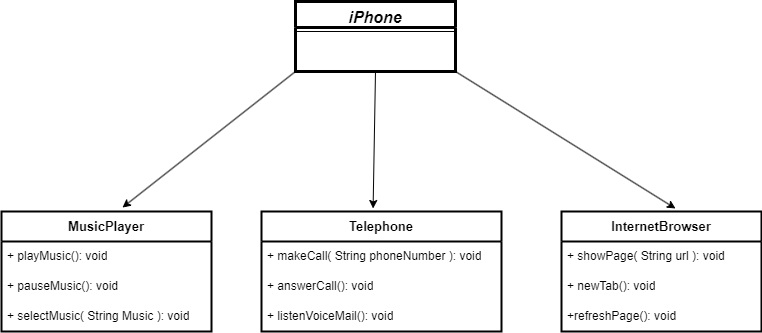

# DIO | Java Básico | Desafio Poo | UML

Desafio da trilha Java Básico da DIO, onde fiquei responsável por modelar e diagramar a representação UML do componente Iphone, abrangendo funcionalidades como Reprodutor Musical, Aparelho Telefônico e Navegador na Intenet.
Para os nome das funcionalidades e metodos, optei por usar nomes em **inglês** para exercitar minha compreensão da lingua.

 

## Descrição

Este projeto é uma implementação de um componente iPhone, modelando suas principais funcionalidades: Reprodutor Musical, Aparelho Telefônico e Navegador na Internet. O objetivo é apresentar uma representação UML e uma implementação em Java.

## Funcionalidades

- **Music Player | Reprodutor Musical**
  - Play Music (Tocar Música), Pause Music (Pausar Música) e Select Music (Selecionar Música).
  
- **Telephone | Aparelho Telefônico**
  - Make Call (Fazer chamadas), Answer Call (Atender Ligação) e Listen Voice Mail (Ouvir Correio de Voz).
  
- **Internet Browser | Navegador na Internet**
  - Show Page (Exibir página), New Tab (Abrir nova aba) e Refresh Page (Atualizar página).

## Tecnologias Usadas

- **Linguagem**:
  - Java
- **Ferramentas**: 
  - IntelliJ IDEA (IDE)
  - Git (Controle de versão)
    
## Como executar o projeto:
Clone o repositório ou baixe o projeto, execute a classe `Iphone` que contém o método `main()`.

## Licença
Esse projeto está licenciado sob a **Licença MIT**

## Disclaimer

Este projeto não é afiliado, endossado ou de qualquer forma associado à Apple Inc. O nome "iPhone" e todos os direitos relacionados são marcas registradas da Apple Inc. Este projeto é uma representação acadêmica e não deve ser utilizado para fins comerciais.

## Contato
Para dúvidas ou sugestões, sinta-se a vontade para entrar em contato:
- Thiago Piassi - thi_piassi@hotmail.com
- <a href="http://linkedin.com/in/thiagopiassi/"> Linkedin</a>
